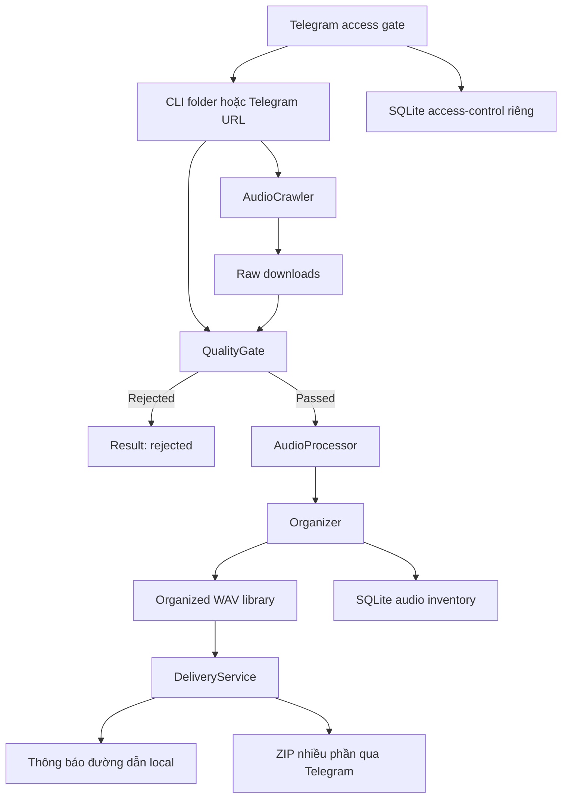

# BÁO CÁO KIỂM TOÁN VÀ BÀN GIAO MH-DOWSAMPLE

> Dành cho Claude Opus 4.8 trước khi nâng cấp dự án  
> Thời điểm kiểm tra: 2026-07-16, múi giờ Asia/Saigon  
> Workspace thật đã kiểm tra: `J:\Minh_Hieu_Coding_2026\MH-Dowsample`  
> Mức độ kiểm tra: Git, mã nguồn, cấu hình đã che bí mật, test, lint, type check, security scan, công cụ runtime, SQLite, thư viện WAV/raw và tài liệu cũ

---

## 1. Kết luận điều hành

Đây là một dự án Python thật, đã xử lý dữ liệu âm thanh thật và có thư viện runtime nhất quán. Nó không phải bộ mock hoặc chỉ là tài liệu ý tưởng.

Nguồn Git chính thức hiện được cấu hình là:

- Remote: `https://github.com/studiozengermany-cmd/MH---DOWSAMPLE-PRO.git`
- Nhánh hiện tại: `main`
- Commit phát hành gần nhất: `91687da88ef55d39a325dcb90b676df75c850ea4`
- Tên commit: `Publish professional MH-Dowsample v4.1 release`
- Phiên bản khai báo trong `pyproject.toml`: `4.1.0`

Tuy nhiên, trạng thái đang nằm trên máy không còn chỉ là v4.1 đã commit. Working tree chứa một đợt nâng cấp lớn chưa commit:

- 12 file tracked đã sửa;
- 8 file mới chưa được Git theo dõi;
- phần diff tracked có 1.833 dòng thêm và 368 dòng xóa;
- thêm access control bằng mã mời/phê duyệt;
- thêm delivery ZIP qua Telegram và retry;
- thêm kiểm soát redirect chống truy cập địa chỉ private;
- thay crawler Splice;
- thêm contract đóng băng lõi và test tương ứng.

Vì vậy phải phân biệt hai trạng thái:

1. `HEAD 91687da` là bản v4.1 đã commit và là baseline phát hành gần nhất.
2. Working tree hiện tại là ứng viên nâng cấp sau v4.1, có mã thật và test thật nhưng chưa phải release sạch.

Working tree hiện tại chưa sẵn sàng phát hành vì:

- test suite: 136 pass, 1 fail;
- coverage: 79,21%, vượt ngưỡng 68%;
- Ruff: fail 1 lỗi sắp xếp import;
- Mypy: pass;
- Bandit mức `-ll`: pass;
- import smoke: pass;
- `pip check`: pass.

Lỗi test duy nhất là lỗi contract có chủ đích nhưng chưa được xử lý dứt điểm: fingerprint của `crawler.py` và `quality_gate.py` khác baseline được ghi trong `tests/test_frozen_core_contract.py`.

Thư viện runtime là dữ liệu thật:

- SQLite có 291 record audio;
- cả 291 đường dẫn record đều tồn tại;
- 291/291 WAV đọc được;
- cả 291 WAV đều PCM không nén, 44.1 kHz, 16-bit, stereo;
- `PRAGMA quick_check` của SQLite trả về `ok`;
- kho raw có 437 MP3.

Phần access control mới chưa được chứng minh là đã chạy production trên máy này:

- `data/access-control.db` chưa tồn tại;
- bot hiện không có process đang chạy;
- log vận hành gần nhất có từ ngày 2026-07-15, trước thời điểm nhiều file nâng cấp được sửa ngày 2026-07-16.

Kết luận ngắn: lõi audio và dữ liệu thư viện là thật; đợt nâng cấp access/delivery hiện tại là mã ứng viên chưa phát hành và chưa chạy production; các tài liệu/bản backup bị ignore không phải nguồn sự thật.

---

## 2. Quy tắc xác định “cái nào là thật”

Claude phải dùng thứ tự ưu tiên sau khi có mâu thuẫn:

| Mức | Nguồn | Ý nghĩa |
| --- | --- | --- |
| 1 | Mã trong working tree hiện tại | Mục tiêu kỹ thuật mới nhất đang được phát triển |
| 2 | `git diff` so với `HEAD 91687da` | Cho biết chính xác phần nào là nâng cấp chưa phát hành |
| 3 | Test đang chạy và kết quả kiểm tra thực tế | Bằng chứng hành vi hiện tại, nhưng test không đồng nghĩa production |
| 4 | SQLite, thư viện `organized/`, `downloads/` và log runtime | Bằng chứng hệ thống từng xử lý dữ liệu thật |
| 5 | `README.md` và `FROZEN_CORE_CONTRACT.md` hiện tại | Tài liệu định hướng; phải đối chiếu lại với mã/test |
| 6 | README tại commit `91687da` | Mô tả bản phát hành v4.1 cũ |
| Không dùng làm chuẩn | `Code.md`, `.code_ideald/`, `.ai-backups/`, `test_pw.py`, `AWS_ACTIVATE_FOUNDERS_APPLICATION.md`, `.claude/`, `.agents/` | Bản nháp, backup, trạng thái trợ lý hoặc tiện ích thử cũ |

Không được lấy một đoạn markdown cũ rồi ghi đè lên mã hiện tại. Không được lấy file trong `.ai-backups` làm phiên bản mới hơn. Không được coi test mock là bằng chứng một website thật vẫn hoạt động.

---

## 3. Nhận dạng dự án chuẩn

### 3.1 Tên đang được dùng

Dự án đang có nhiều tên cùng chỉ một sản phẩm:

| Vị trí | Tên |
| --- | --- |
| Thư mục local | `MH-Dowsample` |
| README/logo | `MH-Dowsample` |
| Remote GitHub | `MH---DOWSAMPLE-PRO` |
| Tên Telegram bot | `MH - Downsample Pro` |
| Package metadata | `audio-organizer` |
| Tiêu đề CLI | `Audio Organizer v4.1` |

Đây là bất nhất tên gọi, không phải nhiều dự án khác nhau. Nếu nâng cấp branding, cần chọn một tên sản phẩm chuẩn và tách tên package kỹ thuật ra rõ ràng.

### 3.2 Entry point thật

- CLI local: `python organize.py ...`
- Telegram bot: `python bot.py`
- Benchmark offline: `python tools/benchmark_onset.py ...`
- `setup_bot_api.py` là script quản trị cũ, không phải entry point production hiện tại.

### 3.3 Nền tảng và dependency

- Python yêu cầu theo metadata: từ 3.11 trở lên.
- CI chỉ kiểm tra Python 3.11 và 3.12.
- Runtime đã kiểm tra: Python 3.12.10.
- FFmpeg/FFprobe đã kiểm tra: 8.1.2.
- Node đã kiểm tra: v24.17.0.
- Playwright driver và Chromium khởi chạy thành công khi đi qua `config.configure_playwright_runtime()`.
- Dependency production được khai báo trong `requirements.txt`.
- Dependency test/lint/type/security nằm trong `requirements-dev.txt`.
- Không có lockfile; dependency chỉ được giới hạn bằng khoảng version.

Lưu ý Python 3.13:

- test phát cảnh báo `audioop`, `aifc` và `sunau` sắp/đã bị loại khỏi Python 3.13;
- `pydub 0.25.x` dùng `audioop`;
- metadata đang ghi `>=3.11` nhưng bằng chứng thực tế chỉ bảo đảm 3.11–3.12.

Trước khi tuyên bố hỗ trợ 3.13, phải thay/upgrade dependency liên quan và thêm Python 3.13 vào CI. Nếu chưa làm, nên giới hạn metadata thành `>=3.11,<3.13`.

---

## 4. Trạng thái Git chính xác

### 4.1 Lịch sử

Repo chỉ có hai commit local:

1. `7d1cd73` — Initial commit.
2. `91687da` — Publish professional MH-Dowsample v4.1 release.

Không có Git tag.

Nhánh `main` không hiển thị upstream tracking trong `git branch -vv` dù remote `origin` tồn tại. Trước khi pull/push cần kiểm tra `origin/main` và thiết lập upstream có chủ đích.

Có bốn local branch tên `worktree-agent-*` cùng trỏ vào `91687da`. `git worktree list` chỉ báo một worktree hiện hoạt là workspace chính. Các branch này là dấu vết công việc trợ lý, không phải release branch. Không xóa nếu chưa xác nhận không còn cần.

### 4.2 File tracked đã sửa

- `.env.example`
- `README.md`
- `bot.py`
- `config.py`
- `crawler.py`
- `exceptions.py`
- `organize.py`
- `quality_gate.py`
- `tests/test_bot.py`
- `tests/test_config.py`
- `tests/test_crawler.py`
- `tests/test_quality_gate.py`

### 4.3 File mới chưa tracked

- `FROZEN_CORE_CONTRACT.md`
- `access_control.py`
- `delivery.py`
- `tests/test_access_control.py`
- `tests/test_delivery.py`
- `tests/test_frozen_core_contract.py`
- `tests/test_network.py`
- `utils/network.py`

### 4.4 Ý nghĩa của diff

Đợt nâng cấp hiện tại thay đổi hệ thống từ bot chỉ dành cho admin sang bot có người dùng được duyệt:

- bỏ luồng login tương tác cũ khỏi bot;
- thêm mã mời dùng một lần;
- thêm trạng thái pending/approved/rejected/blocked/revoked;
- thêm callback quản trị quyền;
- thêm giao kết quả bằng ZIP nhiều phần;
- admin có thể chọn giao local, Telegram hoặc cả hai;
- approved user nhận ZIP Telegram;
- thêm retry/timeouts cho upload;
- duplicate có thể trỏ lại file WAV đã tồn tại;
- thêm kiểm soát redirect HTTP;
- thay logic discovery Splice bằng đọc catalogue có giới hạn trang;
- thêm contract đóng băng ranh giới core/delivery.

`pyproject.toml` vẫn là 4.1.0. Do đó đây chưa phải release có version mới.

---

## 5. Kiến trúc hiện tại



### 5.1 Luồng CLI

`organize.py`:

1. quét đệ quy các extension audio;
2. loại thư mục output khỏi input scan;
3. hash SHA-256 file nguồn;
4. kiểm tra duplicate bằng SQLite;
5. phân tích chất lượng/classification;
6. với dry-run, trả `would_pass`;
7. chuyển đổi/normalize/tag WAV trong staging;
8. publish atomically bằng file `.part` rồi `os.replace`;
9. insert metadata vào SQLite trong transaction;
10. mặc định xóa source sau khi thành công, trừ khi có `--copy`;
11. ghi `data/reports/latest.jsonl`;
12. checkpoint và đóng connection pool.

### 5.2 Luồng Telegram URL

`bot.py`:

1. kiểm tra quyền approved hoặc admin;
2. chỉ cho một URL job chạy tại một thời điểm qua `url_job_lock`;
3. crawler tìm URL audio;
4. tải tối đa bốn URL đồng thời;
5. xử lý các file đã tải theo thứ tự hoàn tất download;
6. lưu raw vào `downloads/<site>/...`;
7. tạo result contract;
8. gọi đúng điểm giao:

   `await self._send_processed_files(update, results, site)`

9. `DeliveryService` đọc result và giao file nhưng không được sửa thư viện/raw.

### 5.3 Ranh giới core/delivery

Contract hiện tại quy định:

- status hợp lệ chính: `passed`, `duplicate`, `rejected`, `error`;
- `passed` phải có `output`;
- `duplicate` nên có `output` nếu DB có record;
- `rejected` có `analysis` và `issues`;
- `error` có `error`;
- `raw` được bot thêm sau khi archive raw;
- chỉ `passed` và `duplicate` có output tồn tại mới được giao.

Các file được tuyên bố đóng băng:

- `crawler.py`
- `quality_gate.py`
- `processor.py`
- `organizer.py`
- `organize.py`
- symbol `AudioBot.handle_url`

Nhưng tài liệu cũng ghi `crawler.py` và `quality_gate.py` đã được mở khóa giới hạn ngày 2026-07-16. Test fingerprint chưa được cập nhật theo việc mở khóa đó, nên CI đang fail. Đây là mâu thuẫn phải giải quyết bằng phê duyệt, không được âm thầm thay hash.

---

## 6. Bản đồ module và vai trò thật

| File | Vai trò thật | Trạng thái |
| --- | --- | --- |
| `organize.py` | Entry point CLI, orchestration, result contract, report JSONL | Production core |
| `quality_gate.py` | Preflight HTTP, ffprobe/librosa, heuristic quality/classification/BPM/key/genre | Production core |
| `processor.py` | Normalize, resample, PCM 16-bit WAV, ID3 tags trong WAV | Production core |
| `organizer.py` | Hash, duplicate, atomic publish, layout, raw archive, migration, stats | Production core |
| `library_layout.py` | Tên/folder human-readable | Production core |
| `utils/db.py` | SQLite schema và bounded connection pool | Production core |
| `utils/paths.py` | Chống path traversal và sanitize | Production core |
| `utils/retry.py` | Retry sync/async | Production helper |
| `utils/cleanup.py` | Quản lý temp run directory | Production helper |
| `crawler.py` | HTTP/Playwright discovery và streaming download | Production core, đang sửa |
| `utils/network.py` | Validate URL public và redirect từng bước | File mới, production helper |
| `bot.py` | UI/commands Telegram, access gate, orchestration URL | Production entry point, đang sửa lớn |
| `access_control.py` | Invite và user approval trong SQLite riêng | File mới, có test, chưa có DB runtime |
| `delivery.py` | Manifest, ZIP split, retry upload, local/Telegram delivery | File mới, có test, chưa chứng minh live |
| `exceptions.py` | Hệ exception typed | Production |
| `config.py` | Đọc `.env`, validation, path và runtime helpers | Production |
| `setup_bot_api.py` | Script cũ ghi trực tiếp profile/commands Telegram | Legacy nguy hiểm, không dùng làm chuẩn |
| `tools/benchmark_onset.py` | Benchmark offline trên dataset có nhãn | Dev tool, không nằm trong runtime |
| `tests/` | Unit/integration/synthetic tests | Bằng chứng test, không phải dữ liệu production |

---

## 7. Dữ liệu runtime thật

### 7.1 Dung lượng

| Thư mục | Số file | Dung lượng |
| --- | ---: | ---: |
| `data/` | 2.065 | 378.937.496 bytes, khoảng 361,38 MiB |
| `downloads/` | 437 | 130.796.799 bytes, khoảng 124,74 MiB |
| `organized/` | 291 | 407.504.270 bytes, khoảng 388,63 MiB |
| `logs/` | 2 | 6.865 bytes |

Phần lớn `data/` là browser profile:

- `data/browser-profile`: 1.896 file, 369.195.972 bytes;
- `data/bot-browser-profile`: 166 file, 9.483.476 bytes;
- `data/reports`: 0 file.

`data/browser-profile` là profile được code hiện tại tham chiếu. `data/bot-browser-profile` không còn được source hiện tại tham chiếu; nó là dữ liệu legacy từ luồng bot/login cũ. Không xóa tự động; chỉ đánh dấu để kiểm tra/backup rồi cleanup sau.

### 7.2 SQLite audio inventory

Database thật:

`J:\Minh_Hieu_Coding_2026\MH-Dowsample\data\database.db`

Kết quả:

- kích thước DB chính: 225.280 bytes;
- journal mode dùng WAL;
- `PRAGMA quick_check`: `ok`;
- bảng `files`: 291 row;
- bảng `app_meta`: 1 row;
- `library_layout_version`: `3`;
- 291 hash khác nhau;
- 291 đường dẫn không rỗng;
- 291 đường dẫn tồn tại;
- 0 đường dẫn mất.

Phân loại:

- loop: 160;
- fx: 120;
- one-shot: 11.

Nguồn record:

- `splice.com`: 227;
- `splice`: 64.

Genre hint:

- fx: 120;
- trap: 63;
- hip-hop: 31;
- house: 28;
- deep-house: 27;
- one-shot: 11;
- pop: 5;
- dnb: 2;
- lo-fi: 2;
- techno: 2.

Khoảng thời gian `processed_at` trong DB:

- sớm nhất: `2026-07-14T09:01:06.123306+00:00`;
- mới nhất: `2026-07-15T11:37:41.713791+00:00`.

### 7.3 Thư viện audio

`downloads/`:

- 437 file;
- tất cả là MP3;
- `downloads/splice`: 81;
- `downloads/splice.com`: 356;
- `downloads/_debug`: rỗng.

`organized/`:

- 291 WAV;
- `FX`: 120;
- `Loops`: 160;
- `One-Shots`: 11.

Kiểm tra header toàn bộ WAV:

- 291/291 mở được;
- 0 file lỗi;
- 291 file 44.100 Hz;
- 291 file 16-bit;
- 291 file 2 channel;
- 291 file PCM `NONE`.

Số raw lớn hơn số record organized không chứng minh lỗi. Raw có thể gồm duplicate và rejected. Tuy nhiên raw không có inventory riêng và không có retention/dedup policy, nên có nguy cơ tăng dung lượng lâu dài.

### 7.4 Access control runtime

Đường dẫn code sẽ dùng:

`data/access-control.db`

Tại thời điểm audit:

- file chưa tồn tại;
- chưa có user/invite production để kiểm kê;
- lần khởi động `AudioBot` tiếp theo sẽ tự tạo schema.

Do đó không được nói hệ thống approval mới “đang chạy production”. Chỉ được nói nó đã được triển khai trong source và test.

---

## 8. Cấu hình thật nhưng đã che bí mật

`.env` tồn tại và bị `.gitignore` loại đúng.

Đã xác nhận mà không ghi lộ giá trị:

- Telegram token: có cấu hình;
- admin user ID: có cấu hình và là số dương;
- owner delivery mode: `local`;
- archive part: 20 MiB;
- upload timeout: 300 giây;
- upload retry: 3;
- target sample rate: 44.100 Hz;
- workers: 4;
- batch size: 50;
- crawler wait: 8 giây;
- crawler timeout: mặc định 300 giây;
- download max file size: `0`, nghĩa là không giới hạn.

Path runtime thực:

- `DATA_DIR`: workspace `data`;
- `DOWNLOAD_DIR`: workspace `downloads`;
- `OUTPUT_DIR`: workspace `organized`;
- `DB_PATH`: `data/database.db`;
- `REPORT_DIR`: `data/reports`;
- `BROWSER_PROFILE_DIR`: `data/browser-profile`;
- temp root: thư mục temp Windows `audio-organizer`.

Không được ghi token hoặc Telegram ID thật vào báo cáo, commit, log hoặc test fixture.

---

## 9. Kết quả kiểm tra kỹ thuật

### 9.1 Test và coverage

Lệnh tương đương CI đã chạy:

```powershell
.\.venv\Scripts\python.exe -m pytest tests --cov=. --cov-report=term-missing --cov-fail-under=68
```

Kết quả:

- 137 test được chạy;
- 136 pass;
- 1 fail;
- coverage tổng: 79,21%;
- ngưỡng 68% đạt.

Module production đáng chú ý:

| Module | Coverage |
| --- | ---: |
| `access_control.py` | 86% |
| `delivery.py` | 85% |
| `organizer.py` | 84% |
| `processor.py` | 88% |
| `quality_gate.py` | 75% |
| `utils/network.py` | 74% |
| `config.py` | 73% |
| `crawler.py` | 63% |
| `bot.py` | 62% |
| `organize.py` | 34% |

Lỗi duy nhất:

- test: `test_frozen_core_fingerprints_match_confirmed_baseline`;
- `crawler.py` actual hash: `744950b14f3c61db94b58736676f261486e68226727262c4cec6c946dce497eb`;
- expected hash: `21ee0a2776d972de5bb2f8273aef2f8f6c0f2cc6dfd5e1a136ed95710c005a95`;
- `quality_gate.py` actual hash: `3e8315cd848666828ae6b98a2a144bf1a6abff856aca1ca7dd8db410e8a4ec51`;
- expected hash: `87323ffbf8f83ae89a651b8213bf543e4ce0015c93137cbf7978465cf6c6010b`.

Ba file frozen còn lại và fingerprint `AudioBot.handle_url` khớp.

### 9.2 Warnings

Khi bật warnings đầy đủ có 16 warning:

- deprecation của `audioop` trong pydub;
- deprecation của `aifc` và `sunau` trong audioread;
- nhiều `ResourceWarning` về file handle từ `AudioSegment.from_file` và `audio.export`;
- một warning librosa `n_fft` lớn hơn tín hiệu test rất ngắn.

ResourceWarning là nợ kỹ thuật thật. Nó chưa làm test fail nhưng cần xử lý trước khi chạy batch lớn hoặc nâng Python.

### 9.3 Ruff

Lệnh:

```powershell
.\.venv\Scripts\python.exe -m ruff check .
```

Kết quả: fail đúng 1 lỗi `I001` tại import block của `tests/test_crawler.py`. Lỗi có thể auto-fix nhưng chưa được sửa trong audit này.

### 9.4 Mypy

Đã chạy mở rộng hơn CI, gồm cả module mới:

```powershell
.\.venv\Scripts\python.exe -m mypy config.py exceptions.py quality_gate.py processor.py organizer.py organize.py crawler.py bot.py access_control.py delivery.py utils tools --ignore-missing-imports
```

Kết quả: pass, không có issue trong 18 source file.

CI hiện tại chưa liệt kê rõ `access_control.py` và `delivery.py` trong lệnh Mypy. Vì `utils` được đưa theo directory nên `utils/network.py` có thể được quét, nhưng hai module top-level mới cần được thêm rõ vào workflow.

### 9.5 Bandit

Bandit recursive mức medium/high (`-ll`) pass, không có finding được in ra.

Điều này không chứng minh crawler hoàn toàn an toàn trước SSRF/browser abuse; Bandit không mô phỏng network behavior.

### 9.6 Runtime smoke

Đã pass:

- import `config`, `bot`, `crawler`, `delivery`, `access_control`, `organize`;
- `organize.py --help`;
- FFmpeg/FFprobe detection;
- `pip check`;
- Playwright driver start;
- headless Chromium launch/close khi gọi `configure_playwright_runtime()`.

Ở lần chạy đầu của audit, `test_pw.py` bị treo vì diagnostic cũ đi thẳng vào bundled Node và để lại hai Playwright driver process mồ côi. Hai process đã được đóng. Diagnostic local sau đó được sửa để gọi `config.configure_playwright_runtime()`, có timeout 20 giây, đóng browser trong `finally`; lần chạy xác nhận mới đã pass và không để lại process. File này vẫn bị Git ignore nên không phải source chuẩn.

### 9.7 Live integration chưa kiểm tra

Audit này không:

- gửi Telegram message thật;
- upload ZIP thật;
- tạo invite thật trên bot production;
- crawl website public thật;
- chạy một job Splice thật;
- thay đổi hoặc xóa audio production.

Vì vậy không được biến unit test mock thành tuyên bố live integration đã pass.

---

## 10. Cái gì là thật, cái gì chỉ là heuristic hoặc chưa chứng minh

| Tuyên bố | Kết luận trung thực |
| --- | --- |
| Có pipeline xử lý audio thật | Có. DB và 291 WAV chứng minh |
| Có chống duplicate SHA-256 | Có trong code và DB có unique hash |
| Output 44.1 kHz/16-bit WAV | Có. 291/291 file hiện tại đúng |
| Layout Loops/One-Shots/FX | Có và khớp DB |
| BPM/key/genre chính xác như công cụ chuyên dụng | Chưa chứng minh |
| Genre dùng ML model đã train | Không. Runtime là rule heuristic |
| scikit-learn chạy trong production classifier | Không. Chỉ benchmark tool dùng |
| Có benchmark dataset thật trong repo | Không thấy |
| Có benchmark result hiện tại | Không thấy; `data/reports` rỗng và không có `benchmark_results.json` |
| Crawler Splice hiện vẫn chạy live | Chưa kiểm tra live trong audit |
| Access approval đang chạy production | Không; DB access chưa tồn tại và bot không chạy |
| Delivery Telegram nhiều phần đã test | Có unit/integration test mock |
| Delivery Telegram nhiều phần đã upload live | Chưa chứng minh |
| README hiện tại là release đã publish | Không; README đang nằm trong diff chưa commit |
| `FROZEN_CORE_CONTRACT.md` là policy đã commit | Không; file còn untracked |

### 10.1 Classification audio

Runtime dùng heuristic:

- one-shot siêu ngắn nếu dưới 0,8 giây;
- loop score từ onset, regularity, beat và zero-crossing;
- FX là phần còn lại;
- BPM chỉ tính cho loop;
- key dựa trên chroma/profile;
- genre dựa trên BPM và spectral centroid.

Các test classification dùng tín hiệu tổng hợp. Chúng chứng minh code ổn định với fixture, không chứng minh độ chính xác trên sample pack thực.

`tools/benchmark_onset.py` cần dataset có nhãn theo folder `loops/`, `oneshots/`, `fx/`. Dataset đó không có trong repo. Hơn nữa benchmark classifier không hoàn toàn giống production classifier đối với one-shot 0,8–3 giây. Muốn gọi kết quả là “được hiệu chuẩn”, phải đồng bộ logic benchmark với production và lưu artifact/report có version.

---

## 11. Vấn đề và rủi ro cần ưu tiên

### P0 — Phải giải quyết trước khi commit/release

#### P0.1 Working tree chưa có baseline sạch

Có 20 file thay đổi/mới nhưng chưa commit. Không được tiếp tục nâng cấp lớn khi chưa:

1. chốt scope của đợt access/delivery/network;
2. sửa quality gates;
3. tạo commit baseline có thể quay lại;
4. gắn version hoặc release note phù hợp.

#### P0.2 Contract đóng băng đang tự mâu thuẫn

`FROZEN_CORE_CONTRACT.md` nói hai file được mở khóa có chủ đích, nhưng test vẫn giữ hash cũ. Cần review diff của đúng hai file, xác nhận contract output không đổi, rồi mới cập nhật fingerprint bằng một commit có lý do rõ.

Không sửa test thành bỏ qua. Không xóa test. Không cập nhật hash chỉ để CI xanh.

#### P0.3 Ruff fail

Sắp xếp import `tests/test_crawler.py` và chạy lại toàn bộ Ruff/test.

#### P0.4 Chưa có bằng chứng live cho tính năng mới

Access DB chưa tồn tại, bot không chạy, Telegram delivery chưa live-test. Trước release cần smoke test trên bot/staging:

- khởi tạo DB access;
- tạo mã;
- submit pending;
- approve;
- approved user gửi URL;
- owner local mode;
- user Telegram mode;
- split ZIP;
- retry/failure;
- restart bot và kiểm tra persistence.

### P1 — Rủi ro hành vi, bảo mật hoặc mất ổn định

#### P1.1 Race duplicate có thể vi phạm delivery contract

Trong `process_file`:

- duplicate phát hiện sớm có `output` qua `metadata_for_hash`;
- nhưng nếu hai worker cùng qua check, một worker thắng insert và worker kia nhận `DuplicateFileError` từ `organizer.organize`, nhánh catch chỉ trả `status` và `file`, không trả `output`.

Delivery sẽ đếm duplicate này là unavailable dù file đã có trong DB. Cần sửa nhánh race để query metadata sau `DuplicateFileError` và trả output hiện hữu. Thêm test concurrency ở mức `process_file` + delivery manifest.

#### P1.2 Download mặc định không giới hạn kích thước

`CRAWL_MAX_FILE_MB=0` nghĩa là unlimited.

Approved user vẫn có thể gửi URL public tới file rất lớn. Librosa nạp audio vào RAM và WAV output có thể phình lớn. Cần:

- default giới hạn hợp lý;
- giới hạn tổng byte/job;
- giới hạn số asset/job;
- kiểm tra `Content-Length` và streaming hard limit;
- giới hạn duration sau metadata probe;
- quota disk tối thiểu trước job.

#### P1.3 Browser SSRF chưa được chặn đầy đủ

`utils/network.py` kiểm tra initial URL và từng HTTP redirect cho requests. Nhưng Playwright có thể tự tải redirect/subresource từ network private trong lúc render một URL public. Chưa thấy route interception chặn request browser tới loopback, private, link-local hoặc metadata endpoint.

Cần thêm:

- `context.route("**/*", handler)` hoặc cơ chế tương đương;
- validate scheme/host trước browser request;
- chặn địa chỉ non-global;
- test redirect/subresource browser;
- cân nhắc profile riêng từng tenant/job.

Kiểm tra DNS trước request vẫn có cửa sổ DNS rebinding vì validation resolve và HTTP client resolve là hai thao tác khác nhau. Nếu threat model cao, cần pin resolved IP/transport hoặc proxy kiểm soát egress.

#### P1.4 `setup_bot_api.py` có thể ghi đè profile mới bằng cấu hình cũ

File này:

- chạy external API ngay khi import/chạy;
- không có `if __name__ == "__main__"`;
- dùng command list cũ: start/stats/path/organize;
- mô tả bot riêng của admin, trái mô hình approved user hiện tại.

Không chạy file này. Nên xóa có chủ đích, hoặc refactor để tái sử dụng command definitions từ `bot.py` và có main guard. Canonical profile sync hiện là `AudioBot.configure_profile`.

#### P1.5 Bot thiếu error handler/health supervision

Log ngày 2026-07-15 ghi:

- application started;
- sau đó có `telegram.error.NetworkError: httpx.ReadError`;
- thông báo “No error handlers are registered”.

Bot hiện không chạy. Cần:

- `application.add_error_handler`;
- structured logging;
- log rotation;
- service manager/auto-restart;
- health/liveness signal;
- graceful retry metric;
- alert nếu polling dừng.

Không kết luận network error này làm bot chết hoàn toàn; nhưng nó chứng minh observability còn thiếu.

#### P1.6 ResourceWarning khi convert

Pydub path phát nhiều warning unclosed file. Cần xác định file object nào chưa được đóng, sửa bằng context manager/file handle rõ ràng hoặc thay conversion path trực tiếp qua ffmpeg subprocess an toàn.

#### P1.7 Telegram ZIP có giới hạn UX

Code bảo đảm kích thước ZIP cuối cùng không vượt limit. Nếu một WAV riêng lẻ vẫn lớn hơn limit sau ZIP, job delivery báo lỗi và giữ file local; user không nhận file.

Cần quyết định:

- gửi file riêng nếu Telegram cho phép;
- chia audio là không mong muốn;
- cung cấp object storage signed URL;
- hoặc đặt duration/file size limit sớm.

README gọi cấu hình là “maximum uncompressed size” nhưng code thực tế kiểm tra final ZIP on-disk size. Sửa tài liệu cho đúng.

### P2 — Nợ kỹ thuật và nâng cấp chất lượng

#### P2.1 Runtime report không đầy đủ

- CLI chỉ ghi đè `data/reports/latest.jsonl`;
- bot URL pipeline không ghi report tương tự;
- `data/reports` hiện rỗng;
- raw không có inventory.

Nên có job table/report immutable:

- job ID;
- requester ID đã pseudonymize;
- source domain;
- discovered/downloaded/passed/rejected/duplicate/error;
- byte in/out;
- started/finished;
- delivery status;
- không log token hoặc signed URL nhạy cảm.

#### P2.2 Raw storage tăng không kiểm soát

Raw có 437 file trong khi organized unique có 291. Không có raw DB/index/retention. Cần policy:

- giữ raw bao lâu;
- dedup raw theo source hash;
- mapping raw → organized;
- cleanup an toàn, có dry-run và backup.

Không được tự xóa 146 file chênh lệch; chúng có thể là rejected hoặc dữ liệu người dùng cần giữ.

#### P2.3 Browser profile quá lớn và có profile legacy

`data/browser-profile` khoảng 352 MiB. Cần:

- cache/cookie retention;
- giới hạn dung lượng;
- không dùng chung profile giữa người dùng nếu có session nhạy cảm;
- migrate/backup `bot-browser-profile` rồi mới dọn;
- đảm bảo profile không bao giờ vào Git.

#### P2.4 Config/dead code không đồng bộ

- `LOGIN_TIMEOUT_SEC` không còn được source production dùng;
- `find_browser_executable()` có test nhưng crawler không gọi;
- `format_results` chỉ còn test dùng;
- các import alias `build_result_archive`, `deliverable_paths` và method `_send_archive_with_retry` trong bot chủ yếu là compatibility layer;
- `setup_bot_api.py` cũ.

Cần quyết định giữ compatibility có thời hạn hay xóa. Không để test duy trì code chết vô hạn.

#### P2.5 Packaging chưa hoàn chỉnh

`pyproject.toml` có metadata tối thiểu nhưng:

- dependency không nằm trong `[project.dependencies]`;
- không có script entry point;
- không có build backend rõ;
- source là các module top-level, chưa là package;
- không có lockfile.

Hiện cách chạy thật là clone + requirements + chạy file. Nếu muốn phân phối, nên package hóa có kế hoạch, không di chuyển module hàng loạt trong cùng PR với sửa behavior.

#### P2.6 Version và branding chưa đồng bộ

Tính năng thay đổi lớn nhưng version vẫn 4.1.0. Tên local/remote/package/bot khác nhau. Cần một tài liệu naming/version policy.

#### P2.7 CI thiếu module mới trong Mypy

Thêm `access_control.py` và `delivery.py` vào lệnh CI. Cân nhắc dùng package discovery hoặc config-only command để tránh quên module mới.

#### P2.8 Không có benchmark classifier đã lưu

Muốn nâng chất lượng classification:

1. tạo dataset hợp pháp có nhãn;
2. tách train/test theo pack/producer để tránh leakage;
3. đồng bộ benchmark và production logic;
4. lưu metrics/confusion matrix;
5. version weights/threshold;
6. có regression set cố định.

---

## 12. Tài liệu và file không phải nguồn chuẩn

### `Code.md`

Là nội dung AI/benchmark cũ mô tả v3.0. Bị Git ignore. Không dùng để tái tạo code.

### `.code_ideald/V2.md`, `v3.md`, `V4.md`

Là đề xuất/bản nháp nhiều đời. `V4.md` nói về “wire everything” v4.1 nhưng vẫn chỉ là tài liệu cũ bị ignore. Dùng để hiểu lịch sử, không copy code từ đây.

### `.ai-backups/`

Là snapshot trước các đợt sửa ngày 2026-07-14. Có thể dùng recovery forensic, không phải code mới nhất.

### `test_pw.py`

Là diagnostic Playwright local bị ignore. Bản cũ từng bỏ qua wiring Node, gây treo và để lại hai driver process trong audit. Bản local đã được vá để dùng `configure_playwright_runtime()`, timeout hữu hạn và cleanup browser; smoke test sau vá pass, không còn process Playwright mồ côi. Vì file vẫn bị ignore, Claude không được coi nó là source chuẩn hoặc phụ thuộc vào thay đổi local này khi clone repo mới.

### `AWS_ACTIVATE_FOUNDERS_APPLICATION.md`

Là draft hồ sơ AWS, bị ignore, không phải spec MH-Dowsample.

### `.claude/`, `.agents/`

Là trạng thái local của trợ lý/công cụ. Không phải source sản phẩm.

### Cache/artifact

Không dùng làm source:

- `__pycache__/`
- `.pytest_cache/`
- `.mypy_cache/`
- `.ruff_cache/`
- `.coverage`
- `coverage.xml`
- `.venv/`

---

## 13. Kế hoạch nâng cấp an toàn đề xuất cho Claude Opus 4.8

### Giai đoạn 0 — Đóng baseline hiện tại

1. Đọc toàn bộ báo cáo này.
2. Chạy lại `git status` và xác nhận không có thay đổi mới của người dùng.
3. Không chạm `.env`, `data/`, `downloads/`, `organized/`, `logs/`.
4. Review diff của 20 file hiện tại.
5. Sửa Ruff import.
6. Review đúng diff `crawler.py` và `quality_gate.py`.
7. Nếu chủ dự án phê duyệt mở khóa, cập nhật fingerprint cùng lý do.
8. Chạy toàn bộ test/coverage/Ruff/Mypy/Bandit/import smoke.
9. Commit đợt access/delivery/network thành baseline riêng trước feature mới.

### Giai đoạn 1 — Chứng minh live flow mới

1. Backup `database.db` và runtime paths.
2. Chạy bot staging bằng token/staging chat riêng nếu có.
3. Xác nhận `access-control.db` được tạo riêng.
4. Test toàn bộ state transition của access.
5. Test owner local và approved-user Telegram.
6. Test ZIP 1 phần, nhiều phần, oversized single file, RetryAfter, timeout.
7. Restart bot và xác nhận persistence.
8. Ghi evidence không chứa token/signed URL.

### Giai đoạn 2 — Hardening

1. Giới hạn file, asset, byte và duration/job.
2. Chặn private network trong Playwright route.
3. Sửa duplicate race contract.
4. Thêm error handler/health/service.
5. Sửa ResourceWarning.
6. Tạo audit job/report.
7. Raw/browser retention.

### Giai đoạn 3 — Chất lượng classifier

1. Xây dataset có quyền sử dụng.
2. Benchmark thật.
3. Đồng bộ benchmark/production.
4. Chỉ thay weights/core khi có metrics tốt hơn và regression test.

### Giai đoạn 4 — Packaging và release

1. Chốt tên/version.
2. Nâng version phù hợp.
3. Hoàn thiện pyproject/entry points.
4. Lock dependency hoặc dùng công cụ reproducible.
5. Chạy matrix Windows + Ubuntu, Python 3.11/3.12.
6. Chỉ thêm 3.13 sau khi dependency tương thích.
7. Release note và migration note.

---

## 14. Acceptance criteria trước khi gọi là release mới

Release chỉ được coi là sẵn sàng khi:

- `git status` sạch sau commit có chủ đích;
- không còn file production mới ở trạng thái untracked;
- 100% test pass;
- coverage >= 68%;
- Ruff pass;
- Mypy pass và bao gồm module mới;
- Bandit medium/high pass;
- import smoke pass;
- Playwright launch pass;
- SQLite migration test pass;
- access DB riêng DB audio;
- duplicate race có output;
- crawler có resource limits;
- live staging Telegram flow pass;
- không lộ secret;
- runtime data được backup trước migration;
- README, env example, version và command list khớp code;
- `setup_bot_api.py` không thể ghi đè cấu hình cũ;
- contract fingerprint được phê duyệt, không bypass.

---

## 15. Lệnh kiểm tra chuẩn

Chạy từ:

`J:\Minh_Hieu_Coding_2026\MH-Dowsample`

```powershell
.\.venv\Scripts\python.exe -m pytest tests -v --cov=. --cov-report=term-missing --cov-report=xml --cov-fail-under=68
.\.venv\Scripts\python.exe -m ruff check .
.\.venv\Scripts\python.exe -m mypy config.py exceptions.py quality_gate.py processor.py organizer.py organize.py crawler.py bot.py access_control.py delivery.py utils tools --ignore-missing-imports
.\.venv\Scripts\python.exe -m bandit -r . -x ./.venv,./tests,./tools,./.git -ll
.\.venv\Scripts\python.exe -m pip check
.\.venv\Scripts\python.exe -c "import config, bot, crawler, delivery, access_control, organize; print('IMPORT_SMOKE_OK')"
git diff --check
git status --short --branch
```

Không chạy `setup_bot_api.py` trong quá trình audit.

Không chạy `organize.py` lên thư viện thật mà thiếu `--dry-run` hoặc `--copy`.

---

## 16. Chỉ thị trực tiếp cho Claude Opus 4.8

1. Workspace này là dự án thật. Không tạo lại một “project sạch” khác rồi bỏ code/dữ liệu hiện tại.
2. Bảo vệ tuyệt đối `.env`, `data/database.db`, `downloads/` và `organized/`.
3. Không xóa backup/runtime file chỉ vì nó không tracked.
4. Không dùng `Code.md` hoặc `.code_ideald` làm source.
5. Không chạy `setup_bot_api.py`.
6. Không sửa vùng frozen trước khi phân loại thay đổi và có phê duyệt.
7. Không cập nhật fingerprint chỉ để làm test xanh.
8. Không gọi heuristic BPM/key/genre là AI model đã train.
9. Không tuyên bố access/delivery đã production-live nếu chưa có live evidence.
10. Trước mọi migration DB hoặc layout, tạo backup và dry-run.
11. Giữ result contract tương thích với delivery.
12. Chia thay đổi thành commit nhỏ: baseline/CI, contract, security, operations, classifier, packaging.
13. Mỗi kết luận phải chỉ ra bằng chứng từ code, test hoặc runtime.
14. Nếu README mâu thuẫn code, ưu tiên code + test và sửa README sau.
15. Báo rõ phần nào đã kiểm tra bằng mock, phần nào đã kiểm tra live.

---

## 17. Tóm tắt bàn giao một đoạn

MH-Dowsample là audio organizer Python local-first thật, bản Git đã phát hành gần nhất là v4.1 tại commit `91687da`. Workspace hiện chứa một nâng cấp lớn chưa commit thêm approval/invite, Telegram delivery, redirect hardening và Splice catalogue discovery. Lõi audio đã tạo 291 WAV hợp lệ và SQLite nhất quán, nhưng working tree chưa release-ready vì 1 fingerprint contract test và 1 Ruff import đang fail. Access DB chưa tồn tại, bot không chạy và delivery mới chưa live-test. Claude phải đóng baseline hiện tại trước, bảo vệ toàn bộ dữ liệu runtime, giải quyết contract có phê duyệt, rồi mới harden resource limits, browser SSRF, duplicate race, observability và Python 3.13 compatibility.
