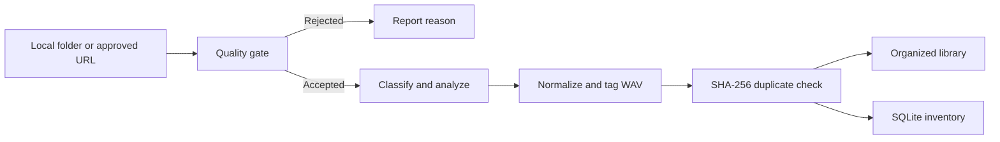

<div align="center">
  
  <h1>MH-Dowsample</h1>
  <p><strong>A local-first audio sample organizer for music producers.</strong></p>
  <p>Analyze quality, classify sounds, normalize audio, remove duplicates, and build a clean,<br>searchable sample library from one command-line workflow.</p>
  <p>
    <a href="https://github.com/studiozengermany-cmd/MH---DOWSAMPLE-PRO/actions/workflows/ci.yml"></a>
    <a href="https://www.python.org/"></a>
    <a href="https://github.com/studiozengermany-cmd/MH---DOWSAMPLE-PRO"></a>
    <a href="LICENSE"></a>
  </p>
  <p><a href="#features">Features</a> · <a href="#quick-start">Quick start</a> · <a href="#usage">Usage</a> · <a href="#telegram-bot">Telegram bot</a> · <a href="#development">Development</a></p>
</div>

---

## Overview

MH-Dowsample turns mixed folders of audio files into a predictable library that is easier to browse
from a DAW. The pipeline inspects every file, estimates musical metadata, converts accepted audio to
tagged 16-bit PCM WAV, detects duplicates with SHA-256, and records the result in SQLite.

The application runs locally. Audio files, browser sessions, the SQLite database, credentials, logs,
and generated libraries are excluded from Git and remain on the user's machine.

## Features

| Capability | What it does |
| --- | --- |
| Quality inspection | Checks duration, bitrate, silence ratio, and readable audio content before accepting a file. |
| Content classification | Distinguishes loops, one-shots, and FX; estimates BPM, musical key, and a practical genre hint. |
| Consistent output | Normalizes accepted audio and exports tagged 44.1 kHz, 16-bit PCM WAV files. |
| Clean library layout | Produces readable, content-first filenames and DAW-friendly folders. |
| Duplicate protection | Uses SHA-256 fingerprints and an SQLite inventory to avoid duplicate imports. |
| Concurrent processing | Processes batches with configurable worker and batch counts. |
| Guarded web discovery | Finds public audio assets through direct URLs, page resources, JSON responses, and media controls. |
| Private Telegram control | Restricts bot commands to the configured administrator account. |

## Processing flow



## Quick start

### Requirements

- Python 3.11 or newer
- FFmpeg and FFprobe available on `PATH`
- Node.js on `PATH` is recommended on Windows for the Playwright driver

### Install

```powershell
git clone https://github.com/studiozengermany-cmd/MH---DOWSAMPLE-PRO.git
cd MH---DOWSAMPLE-PRO

python -m venv .venv
.\.venv\Scripts\Activate.ps1

python -m pip install --upgrade pip
python -m pip install -r requirements.txt
python -m playwright install chromium --only-shell

Copy-Item .env.example .env
```

For development tools, install the additional requirements:

```powershell
python -m pip install -r requirements-dev.txt
```

### Configure

Edit `.env` before the first run. The defaults use folders inside the project directory.

| Variable | Purpose | Default |
| --- | --- | --- |
| `DOWNLOAD_DIR` | Retained source downloads | `./downloads` |
| `OUTPUT_DIR` | Organized WAV library | `./organized` |
| `DB_PATH` | SQLite inventory | `./data/database.db` |
| `TARGET_SAMPLE_RATE` | Output sample rate | `44100` |
| `WORKERS` | Concurrent processing workers | `4` |
| `BATCH_SIZE` | Files processed per batch | `50` |
| `TELEGRAM_TOKEN` | Optional Telegram bot token | empty |
| `ADMIN_USER_ID` | Allowed Telegram user ID | `0` |

See [`.env.example`](.env.example) for every available quality, crawler, timeout, and path setting.

## Usage

> [!IMPORTANT]
> A normal run moves successfully processed source files out of the input folder. Start with
> `--dry-run`, or add `--copy` when the original files must remain in place.

Preview classification without changing files:

```powershell
python organize.py --input .\raw_samples --dry-run
```

Organize files while preserving the originals:

```powershell
python organize.py --input .\raw_samples --output .\organized --copy
```

Run a larger batch with eight workers:

```powershell
python organize.py --input .\raw_samples --workers 8 --batch-size 100 --copy
```

Inspect the current inventory or rebuild an older library layout:

```powershell
python organize.py --stats
python organize.py --rebuild-layout
```

Run `python organize.py --help` for the complete CLI reference.

### Output layout

```text
organized/
├── Loops/<Genre>/Readable Name - 140 BPM - C major.wav
├── One-Shots/Readable Name - C minor.wav
├── FX/Readable Name.wav
└── Unsorted/Readable Name.wav
```

The source website remains searchable metadata in SQLite. Retained downloads use the same
content-first naming approach under `downloads/<Source>/`.

## Telegram bot

Set `TELEGRAM_TOKEN` and `ADMIN_USER_ID` in `.env`, then start the bot:

```powershell
python bot.py
```

| Command | Purpose |
| --- | --- |
| `/start` | Display the usage guide. |
| `/stats` | Show library statistics. |
| `/path` | Show the configured output directory. |
| `/dangnhap` | Open an interactive website login session for a supplied URL. |
| `/organize` | Process a local folder. |

Plain text URLs sent by the configured administrator are passed to the guarded crawler. Use this
feature only for content you are authorized to access and download.

## Development

The GitHub Actions matrix validates Python 3.11 and 3.12 with tests, coverage, linting, type checks,
security analysis, and an import smoke test.

```powershell
python -m pytest tests -v --cov=. --cov-fail-under=68
python -m ruff check .
python -m mypy config.py exceptions.py quality_gate.py processor.py organizer.py organize.py crawler.py bot.py utils tools --ignore-missing-imports
python -m bandit -r . -x ./tests,./tools -ll
```

See [CONTRIBUTING.md](CONTRIBUTING.md) before proposing a change.

## Project structure

```text
MH-Dowsample/
├── organize.py           # CLI entry point and batch orchestration
├── quality_gate.py       # Audio inspection and classification
├── processor.py          # WAV conversion, normalization, and tags
├── organizer.py          # Library placement and duplicate handling
├── library_layout.py     # Readable content-first paths
├── crawler.py            # Guarded browser and HTTP discovery
├── bot.py                # Private Telegram interface
├── utils/                # Database, paths, retries, and cleanup
├── tools/                # Development and benchmark utilities
└── tests/                # Unit, concurrency, and end-to-end tests
```

## Privacy and repository hygiene

The repository intentionally ignores credentials, virtual environments, browser profiles, databases,
downloaded audio, generated libraries, logs, caches, backups, and local working notes. Never commit a
real `.env` file or third-party audio content.

## License

Released under the [MIT License](LICENSE). Copyright © 2026 Minh Hieu Producer.
