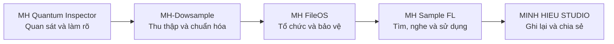
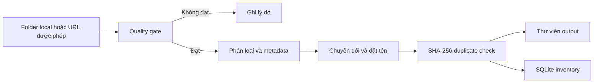

<div align="center">

# MH-Dowsample

### Công cụ local hỗ trợ kiểm tra, phân loại và sắp xếp thư viện sample


[Website](https://studiominhhieu.com/) · [CI](https://github.com/studiozengermany-cmd/MH---DOWSAMPLE-PRO/actions) · [Liên hệ](mailto:support@studiominhhieu.com)

</div>

> [!IMPORTANT]
> MH-Dowsample là công cụ cá nhân đang phát triển. Hãy luôn chạy `--dry-run` trước và dùng `--copy` khi cần giữ nguyên file nguồn. Không chạy trên thư viện quan trọng nếu chưa có backup.

## Mục lục

- [Dự án giải quyết vấn đề gì?](#dự-án-giải-quyết-vấn-đề-gì)
- [Vị trí trong hệ sinh thái MH](#vị-trí-trong-hệ-sinh-thái-mh)
- [Chức năng hiện có](#chức-năng-hiện-có)
- [Cảnh báo an toàn](#cảnh-báo-an-toàn)
- [Cài đặt](#cài-đặt)
- [Cấu hình](#cấu-hình)
- [Hướng dẫn sử dụng](#hướng-dẫn-sử-dụng)
- [Quy trình xử lý](#quy-trình-xử-lý)
- [Telegram bot](#telegram-bot)
- [Kiểm tra khi phát triển](#kiểm-tra-khi-phát-triển)
- [Giới hạn](#giới-hạn)
- [Cấu trúc dự án](#cấu-trúc-dự-án)
- [Giấy phép và liên hệ](#giấy-phép-và-liên-hệ)

## Dự án giải quyết vấn đề gì?

Thư viện sample thường có nhiều nguồn, nhiều định dạng, tên file khó đọc và nhiều bản sao giống nhau. MH-Dowsample được tạo ra để giảm thời gian làm những việc lặp lại:

- kiểm tra file âm thanh có đọc được hay không;
- ước lượng một số metadata thực dụng;
- chuyển đổi output về định dạng nhất quán;
- phát hiện trùng bằng SHA-256;
- tổ chức output thành cấu trúc dễ duyệt hơn trong DAW.

Dự án phục vụ nhu cầu cá nhân trước. Chỉ khi đủ ổn định và an toàn, công cụ mới được cân nhắc chia sẻ rộng hơn.

## Vị trí trong hệ sinh thái MH



MH-Dowsample là bước đầu của chuỗi sample: tiếp nhận folder local hoặc nguồn được người dùng cho phép, kiểm tra và tạo ra thư viện dễ quản lý hơn trước khi chuyển sang MH FileOS và MH Sample FL.

## Chức năng hiện có

| Nhóm | Mô tả |
|---|---|
| Quality inspection | Kiểm tra duration, bitrate, silence ratio và khả năng đọc nội dung audio |
| Classification | Phân loại thực dụng thành loop, one-shot, FX hoặc nhóm chưa xác định |
| Metadata | Ước lượng BPM, key và gợi ý genre khi có thể |
| Conversion | Chuyển file được chấp nhận sang WAV theo cấu hình |
| Duplicate protection | Dùng SHA-256 và SQLite inventory |
| Organization | Tạo tên và cấu trúc folder dễ duyệt hơn |
| Batch processing | Điều chỉnh worker và batch size |
| Web discovery | Hỗ trợ nguồn được người dùng có quyền truy cập |
| Telegram | Giao diện điều khiển riêng, tùy chọn |

## Cảnh báo an toàn

> [!CAUTION]
> Một lần chạy thông thường có thể **di chuyển file nguồn đã xử lý** ra khỏi thư mục input.

### Luôn xem trước

```powershell
python organize.py --input .\raw_samples --dry-run
```

### Giữ nguyên file nguồn

```powershell
python organize.py --input .\raw_samples --output .\organized --copy
```

### Trước khi chạy trên dữ liệu thật

- Tạo backup riêng.
- Thử trên một folder nhỏ.
- Đọc kết quả `--dry-run`.
- Kiểm tra `INPUT`, `OUTPUT` và `DB_PATH`.
- Dùng `--copy` nếu không muốn di chuyển source.
- Không dùng nội dung mà anh không có quyền tải hoặc xử lý.

## Cài đặt

### Yêu cầu

- Python 3.11 trở lên.
- FFmpeg và FFprobe có trong `PATH`.
- Node.js được khuyến nghị trên Windows nếu dùng Playwright.
- Git.

### Clone và tạo môi trường

```powershell
git clone https://github.com/studiozengermany-cmd/MH---DOWSAMPLE-PRO.git
cd MH---DOWSAMPLE-PRO

python -m venv .venv
.\.venv\Scripts\Activate.ps1
python -m pip install --upgrade pip
python -m pip install -r requirements.txt
```

### Cài Chromium cho Playwright

```powershell
python -m playwright install chromium --only-shell
```

### Tạo cấu hình local

```powershell
Copy-Item .env.example .env
```

Không commit `.env` thật, token Telegram, browser profile, database hoặc sample của bên thứ ba.

## Cấu hình

| Biến | Mục đích | Mặc định |
|---|---|---|
| `DOWNLOAD_DIR` | Nơi giữ file tải về | `./downloads` |
| `OUTPUT_DIR` | Thư viện WAV đã tổ chức | `./organized` |
| `DB_PATH` | SQLite inventory | `./data/database.db` |
| `TARGET_SAMPLE_RATE` | Sample rate output | `44100` |
| `WORKERS` | Số worker | `4` |
| `BATCH_SIZE` | Số file mỗi batch | `50` |
| `TELEGRAM_TOKEN` | Token bot tùy chọn | rỗng |
| `ADMIN_USER_ID` | Telegram user ID được phép | `0` |

Sau khi sửa `.env`, kiểm tra lại đường dẫn tuyệt đối trước khi chạy dữ liệu thật.

## Hướng dẫn sử dụng

### 1. Xem trợ giúp

```powershell
python organize.py --help
```

### 2. Dry-run một folder

```powershell
python organize.py --input .\raw_samples --dry-run
```

Dry-run dùng để xem trước phân loại và hành vi dự kiến. Không bỏ qua bước này khi thử folder mới.

### 3. Xử lý và giữ file nguồn

```powershell
python organize.py --input .\raw_samples --output .\organized --copy
```

### 4. Điều chỉnh batch lớn hơn

```powershell
python organize.py --input .\raw_samples --output .\organized --copy --workers 8 --batch-size 100
```

Không tăng worker quá cao khi ổ đĩa chậm hoặc máy ít RAM.

### 5. Xem thống kê inventory

```powershell
python organize.py --stats
```

### 6. Xây lại layout

```powershell
python organize.py --rebuild-layout
```

Chỉ chạy khi đã hiểu rõ database và output hiện tại.

## Quy trình xử lý



Output dự kiến:

```text
organized/
├─ Loops/<Genre>/Tên - 140 BPM - C major.wav
├─ One-Shots/Tên - C minor.wav
├─ FX/Tên.wav
└─ Unsorted/Tên.wav
```

Metadata ước lượng có thể sai. Người dùng vẫn phải nghe và kiểm tra lại.

## Telegram bot

### Cấu hình

Điền trong `.env`:

```text
TELEGRAM_TOKEN=...
ADMIN_USER_ID=...
```

### Chạy bot

```powershell
python bot.py
```

### Lệnh chính

| Lệnh | Chức năng |
|---|---|
| `/start` | Hiện hướng dẫn |
| `/stats` | Xem thống kê |
| `/path` | Xem output path |
| `/dangnhap` | Mở phiên đăng nhập tương tác cho URL được phép |
| `/organize` | Xử lý folder local |

Bot chỉ nên dùng với `ADMIN_USER_ID` của chủ dự án. Không công khai token hoặc mở quyền cho người lạ.

## Kiểm tra khi phát triển

Cài dependency phát triển:

```powershell
python -m pip install -r requirements-dev.txt
```

Chạy test và kiểm tra chất lượng:

```powershell
python -m pytest tests -v --cov=. --cov-fail-under=68
python -m ruff check .
python -m mypy config.py exceptions.py quality_gate.py processor.py organizer.py organize.py crawler.py bot.py utils tools --ignore-missing-imports
python -m bandit -r . -x ./tests,./tools -ll
```

Các lệnh này xác nhận source tại thời điểm chạy. Chúng không thay thế việc thử nghiệm trên bản sao dữ liệu thật.

## Giới hạn

- BPM, key và genre chỉ là ước lượng.
- Chuyển đổi audio có thể làm thay đổi định dạng output.
- Web discovery chỉ dùng cho nội dung người dùng có quyền truy cập.
- Một run thông thường có thể di chuyển source.
- Chưa có cam kết production, SLA hoặc hỗ trợ doanh nghiệp.
- Chưa nên chạy trên thư viện duy nhất không có backup.
- Badge hoặc version number không phải bằng chứng sản phẩm đã hoàn thiện.

## Cấu trúc dự án

```text
MH-Dowsample/
├─ organize.py            # CLI entry point
├─ quality_gate.py        # Kiểm tra và phân loại
├─ processor.py           # Conversion và metadata
├─ organizer.py           # Đặt file và duplicate handling
├─ library_layout.py      # Cấu trúc output
├─ crawler.py             # Web discovery có kiểm soát
├─ bot.py                 # Telegram interface
├─ utils/                 # Database, path, retry, cleanup
├─ tools/                 # Công cụ phát triển
└─ tests/                 # Unit và end-to-end tests
```

## Giấy phép và liên hệ

Source phát hành theo [MIT License](LICENSE). Giấy phép source không cấp quyền sử dụng đối với file âm thanh, website hoặc nội dung của bên thứ ba.

- Website: https://studiominhhieu.com/
- Email: support@studiominhhieu.com
- GitHub: https://github.com/studiozengermany-cmd

---

<div align="center">

**Dry-run trước. Backup trước. Người dùng quyết định cuối cùng.**

</div>
